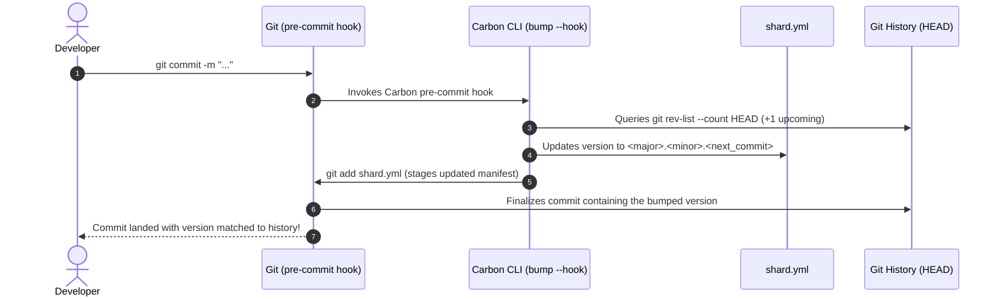

# Carbon ⚡

[](https://github.com/sol-vin/carbon/actions/workflows/ci.yml)
[](https://crystal-lang.org)
[](https://opensource.org/licenses/MIT)

> **Lapis-style automated version control and Crystal DSL for modern apps and shards.**

Carbon eliminates manual version bumping, release friction, and commit hash desyncs by implementing **Lapis-style versioning**:

$$\textbf{Version Format:} \quad \mathbf{\langle major \rangle.\langle minor \rangle.\langle commit\_number \rangle}$$

- **`commit_number`**: Automatically advances with every Git commit, ensuring every build and commit is distinctly and monotonically identified.
- **`major.minor`**: Left entirely up to the developer to bump when cutting feature milestones or breaking changes.
- **Zero-Friction Git Hooks**: Auto-stages updated `shard.yml` during `pre-commit` so that each commit carries its exact chronological build number in its own Git tree.
- **Compile-Time Macro DSL**: Embeds version constants into your Crystal classes and modules with zero runtime overhead via `Carbon.version!`.
- **Self-Versioning**: Carbon eats its own dogfood—it auto-increments its own version with each commit.

---

## Quick Start (30 Seconds)

### 1. Add to `shard.yml`

```yaml
development_dependencies:
  carbon:
    github: sol-vin/carbon
    branch: main
```

Run `shards install`.

### 2. Initialize Carbon in Your Repo

From your repository root, run:

```bash
bin/carbon init
```

This will:
1. Verify and align `shard.yml` to the `major.minor.commit_number` format (default: `0.1.0`).
2. Install a non-destructive Git `pre-commit` hook in `.git/hooks/pre-commit`.

### 3. Commit As Usual!

```bash
git commit -m "feat: add super cool feature"
```

```text
[carbon] Auto-bumped version to 0.1.1 (commit #1)
[main 7f2e1a0] feat: add super cool feature
 2 files changed, 45 insertions(+)
```

Your `shard.yml` is automatically updated and committed together with your changes!

---

## Crystal Macro DSL

Carbon provides compile-time and runtime helpers to access version metadata within your Crystal app.

```crystal
require "carbon"

module MyApp
  # Reads shard.yml at compile time and defines:
  # - VERSION (String)
  # - MAJOR_VERSION (Int32)
  # - MINOR_VERSION (Int32)
  # - COMMIT_VERSION (Int32)
  # - MyApp.version
  # - MyApp.carbon_version -> Carbon::Version
  Carbon.version!
end

puts "Running #{MyApp::NAME} v#{MyApp::VERSION}"
# => "Running MyApp v0.1.1"

# Compare versions semantically:
if MyApp.carbon_version >= Carbon::Version.parse("0.1.0")
  puts "Feature enabled!"
end
```

---

## How It Works: The Lapis Pattern



### Why `pre-commit` Instead of `post-commit`?
Most version bouncers run on `post-commit`, which requires generating an unwanted secondary "bump version" commit or running `git commit --amend`, causing messy Git graphs and detached heads.

Carbon's `pre-commit` architecture computes the exact upcoming commit index ($N+1$), writes it to `shard.yml`, and stages it. When Git seals the commit, the commit's tree **already contains the exact version matching that commit**.

---

## CLI Reference

Carbon includes a fast, standalone binary:

```bash
carbon <command> [options]
```

| Command | Description |
| :--- | :--- |
| `carbon init` | Initializes Carbon in the current repo, creates or formats `shard.yml`, and installs the Git hook. |
| `carbon bump` | Manually bumps the version counter (options: `--minor`, `--major`, `--commit`, `--hook`). |
| `carbon sync` | Re-aligns `shard.yml` with the exact Git commit count (useful after merging PRs or rebasing). |
| `carbon set <major.minor>` | Sets the major and minor numbers (e.g. `carbon set 1.2` $\to$ `1.2.<commits>`). |
| `carbon get`, `version` | Displays the current version. Pass `-p` or `--porcelain` for script-friendly output. |
| `carbon check` | Audits whether `shard.yml` matches Git HEAD commit count. Returns exit code `0` on sync, `1` on mismatch. |
| `carbon hook [install\|uninstall\|status]` | Manages the Git pre-commit hook non-destructively. |

### CLI Examples

```bash
# Bump minor version (e.g. 0.1.42 -> 0.2.42)
carbon bump --minor

# Bump major version (e.g. 0.2.42 -> 1.0.42)
carbon bump --major

# Explicitly set major and minor
carbon set 2.0

# Print raw version for deployment or Docker tag
carbon get --porcelain
# => 2.0.42

# Verify in CI that shard.yml was not tampered with
carbon check
```

---

## Non-Destructive Git Hook Chaining

If your project already uses a pre-commit hook (for linters, formatting, or tests), Carbon will never overwrite it. It encapsulates its commands within explicit managed markers:

```sh
#!/bin/sh
# Existing user linters:
crystal tool format --check

# >>> CARBON AUTO-VERSION HOOK >>>
# Generated by Carbon. Do not edit this block manually.
if [ -f "bin/carbon" ]; then
  ./bin/carbon bump --hook
elif command -v carbon >/dev/null 2>&1; then
  carbon bump --hook
elif command -v crystal >/dev/null 2>&1; then
  if [ -f "src/carbon/cli.cr" ]; then
    crystal run src/carbon/cli.cr -- bump --hook
  elif [ -f "lib/carbon/src/carbon/cli.cr" ]; then
    crystal run lib/carbon/src/carbon/cli.cr -- bump --hook
  fi
fi
# <<< CARBON AUTO-VERSION HOOK <<<
```

Running `carbon hook uninstall` safely strips only Carbon's block and restores your original hook.

---

## Continuous Integration (GitHub Actions)

Add this workflow to `.github/workflows/ci.yml` in your project to verify formatting, test suites, and build targets:

```yaml
name: CI

on:
  push:
    branches: [ main, master ]
  pull_request:
    branches: [ main, master ]

jobs:
  test:
    name: Test & Build
    runs-on: ubuntu-latest
    steps:
      - name: Checkout repository
        uses: actions/checkout@v4
        with:
          fetch-depth: 0 # Full commit history required for commit counting

      - name: Install Crystal
        uses: crystal-lang/install-crystal@v1
        with:
          crystal: latest

      - name: Check Formatting
        run: crystal tool format --check

      - name: Run Test Specifications
        run: crystal spec --error-trace

      - name: Verify Version Alignment
        run: |
          shards build carbon
          bin/carbon check
```

> [!TIP]
> Ensure `fetch-depth: 0` is set in `actions/checkout@v4` so that Git has access to the full commit history to count commits accurately.

---

## Running Specs

```bash
# Run full test specifications
crystal spec --error-trace

# Build CLI binary
shards build carbon
```

---

## License

MIT License. Copyright (c) 2026 Ian Rash. See [LICENSE](LICENSE) for details.
