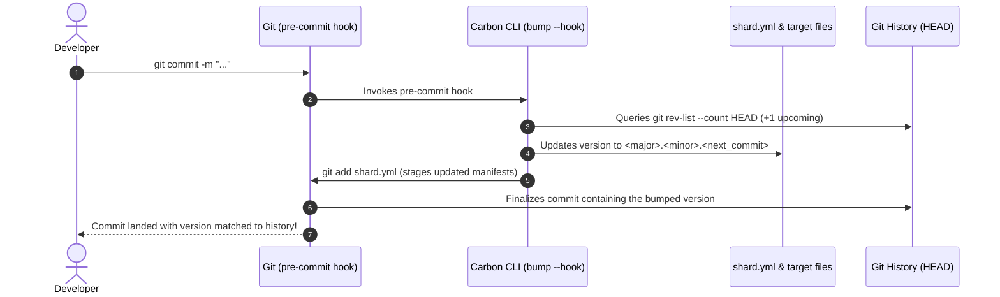
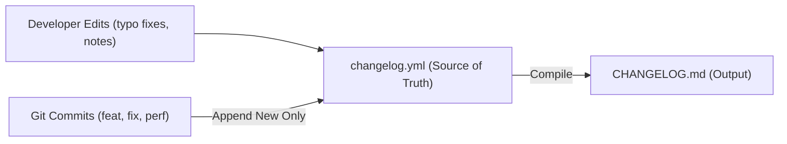
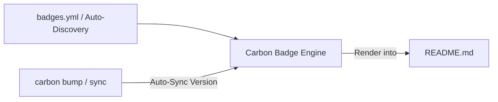

# Carbon ⚡

<!-- carbon:badges -->
[](https://github.com/sol-vin/carbon/actions/workflows/ci.yml)
[](https://crystal-lang.org)
[](https://github.com/sol-vin/carbon/releases)
[](LICENSE)
<!-- /carbon:badges -->

> **Automated commit-based version control, human-friendly YAML changelogs, and Crystal DSL for modern apps and shards.**

Carbon eliminates manual version bumping, release friction, and commit desyncs through a clean, automated Git workflow:

$$\textbf{Version Format:} \quad \mathbf{\langle major \rangle.\langle minor \rangle.\langle commit\_number \rangle}$$

- **`commit_number`**: Automatically advances with every Git commit, ensuring every build and commit is distinctly and monotonically identified.
- **`major.minor`**: Left entirely under developer control to bump when cutting feature milestones or breaking changes.
- **Zero-Friction Git Hooks**: Automatically stages updated manifests during `pre-commit` so that each commit carries its exact chronological build number in its own Git tree.
- **YAML-Driven Changelogs (`changelog.yml` $\to$ `CHANGELOG.md`)**: Human-editable YAML source of truth that compiles into structured Markdown. **Never overwrites existing entries**, preserving all your hand-written descriptions, typo fixes, custom notes, and bullet choices permanently.
- **Badge Management System (`badges.yml` $\to$ `README.md`)**: Automatically updates and renders version, CI, Crystal, license, and docs badges into markdown tags (`<!-- carbon:badges -->`), keeping documentation 100% in sync with releases.
- **Multi-Target File Synchronization**: Automatically updates `shard.yml`, `src/**/version.cr`, and C/C++ version headers simultaneously, ending version drift across multi-component projects.
- **Git Tag & Release Manager**: Seals changelog entries, tags annotated Git releases (`vX.Y.Z`), updates floating `latest` tags, and pushes with zero friction.
- **Compile-Time Macro DSL**: Injects version and Git metadata into your classes with zero runtime overhead via `Carbon.version!`.
- **Repository Doctor (`carbon doctor`)**: Audits Git health, hook integrity, and version consistency across all files, offering `--fix` to repair issues automatically.
- **Self-Versioning**: Carbon automatically version-controls and changelogs itself on every commit.

---

## How Carbon Version Control Works



### Why `pre-commit` Instead of `post-commit`?
Most version bouncers run on `post-commit`, which requires generating an unwanted secondary "bump version" commit or running `git commit --amend`, causing messy Git graphs and detached heads.

Carbon's `pre-commit` architecture computes the exact upcoming commit index ($N+1$), writes it to `shard.yml` (and any configured `version.cr` or C headers), and stages them. When Git seals the commit, the commit's tree **already contains the exact version matching that commit**.

---

## Quick Start (30 Seconds)

### 1. Add to `shard.yml`

```yaml
development_dependencies:
  carbon:
    github: sol-vin/carbon
    branch: main
```

Run `shards install`.

### 2. Initialize Carbon in Your Repo

From your repository root, run:

```bash
bin/carbon init
```

This will:
- Format or create `shard.yml` to the `major.minor.commit_number` standard (default: `0.1.0`).
- Install a non-destructive Git `pre-commit` hook in `.git/hooks/pre-commit`.
- Create a human-friendly `changelog.yml` and compile `CHANGELOG.md`.

### 3. Commit As Usual!

```bash
git commit -m "feat(api): add automatic stream parsing"
```

```text
[carbon] Auto-bumped version to 0.1.1 (commit #1)
[main 7f2e1a0] feat(api): add automatic stream parsing
 3 files changed, 52 insertions(+)
```

Your `shard.yml`, target files, and `CHANGELOG.md` are automatically updated and staged with the commit!

---

## Automatic Changelogs (`changelog.yml` $\to$ `CHANGELOG.md`)

Most changelog generators either destroy hand-written edits or produce unformatted walls of text. Carbon solves this by decoupling the **human-editable source (`changelog.yml`)** from the **compiled Markdown (`CHANGELOG.md`)**.



### Absolute Non-Destructive Invariant
> [!IMPORTANT]
> **Carbon NEVER overwrites an existing entry.**
> Each entry is tracked by its Git `hash` and subject. When new commits are scanned, Carbon only appends **unseen** commits. If you edit a description, fix a typo, rephrase a bullet, remove sensitive text, or change bullet icons in `changelog.yml`, **your changes are 100% permanent**.

### Layout of `changelog.yml`

```yaml
settings:
  title: "CARBON CHANGELOG"
  output_file: "CHANGELOG.md"
  ascii_banner: |
     ____ ___  ____  ____   ___  _   _ 
    / ___/ _ \|  _ \| __ ) / _ \| \ | |
   | |  | |_| | |_) |  _ \| | | |  \| |
   | |__|  _  |  _ <| |_) | |_| | |\  |
    \____/_/ \_|_| \_\____/ \___/|_| \_|
  header: |
    All notable changes to this project are documented in this file.
    Maintained automatically by Carbon.

  # Category definitions, custom titles, and default bullets
  categories:
    breaking:
      title: "💥 Breaking Changes"
      bullet: "▲"
    features:
      title: "✨ Features & Improvements"
      bullet: "✦"
    fixes:
      title: "🐛 Bug Fixes"
      bullet: "✓"
    perf:
      title: "⚡ Performance Optimizations"
      bullet: "🚀"
    docs:
      title: "📚 Documentation"
      bullet: "📖"
    maintenance:
      title: "🛠️ Chores & Tooling"
      bullet: "•"

releases:
  - version: "0.1.2"
    date: "2026-10-01"
    status: active # 'active' (receives new commits) or 'released'
    summary: "Stabilization release with dynamic macro version assertions and test hardening."
    entries:
      - type: test
        description: "dynamically assert macro version against shard.yml"
        bullet: "✓"
        hash: "1e4bc97"
        author: "Ian Rash"

  - version: "0.1.1"
    date: "2026-10-01"
    status: released
    summary: "Initial public release of Carbon version control shard."
    entries:
      - type: feat
        description: "initial commit for carbon version control shard"
        bullet: "✦"
        badge: "[CORE]"
        hash: "55eff71"
        author: "Ian Rash"
```

### Custom Bullets and Badges
You can customize bullets on a per-entry level or per-category level:
- `bullet: "🚀"` or `"✓"`, `"✦"`, `"▲"`, `"•"`
- `badge: "[SECURITY]"` or `"[CLI]"`, `"[BREAKING]"`

To synchronize or compile your changelog:

```bash
# Pull new commits and compile CHANGELOG.md
carbon changelog

# Preview without writing to disk
carbon changelog --dry-run

# Recompile existing changelog.yml to CHANGELOG.md after manual editing
carbon changelog --compile
```

---

## Multi-Target File Synchronization

In complex Crystal codebases, version numbers often exist in multiple places:
- `shard.yml` (`version: 0.2.0`)
- `src/my_app/version.cr` (`VERSION = "0.1.0"`)
- C/C++ bridge headers (`#define LIB_VERSION "0.1.0"`)

Carbon automatically locates and synchronizes all version constants whenever you bump or set a version:

```bash
# Bumps minor version across shard.yml, src/**/version.cr, and headers
carbon bump --minor

# Explicitly set major and minor
carbon set 2.0
```

---

## Tagging & Release Management

Carbon provides a single command to tag and seal releases:

```bash
carbon tag v1.0.0 --message="Initial stable release" --push
```

This will:
1. Seal the current active release in `changelog.yml` (marks `status: released`, stamps today's date).
2. Recompile `CHANGELOG.md`.
3. Create an annotated Git tag `v1.0.0`.
4. Update the floating `latest` Git tag to point to this release.
5. Push the branch and both tags (`v1.0.0`, `latest`) to `origin`.

---

## Repository Health Doctor (`carbon doctor`)

Audit your project's versioning and release hygiene with `carbon doctor`:

```bash
carbon doctor
```

```text
Carbon Doctor Audit Findings:
  1. [Hooks] Carbon pre-commit hook is not installed in .git/hooks/pre-commit [auto-fixable]
  2. [Version] src/my_app/version.cr version (0.1.0) differs from shard.yml (0.1.2) [auto-fixable]

Run 'carbon doctor --fix' to automatically repair fixable issues.
```

To automatically repair detected issues:

```bash
carbon doctor --fix
```

---

## Non-Destructive Git Hook Chaining

If your project already uses a pre-commit hook (for linters, formatting, or tests), Carbon will never overwrite it. It encapsulates its commands within explicit managed markers:

```sh
#!/bin/sh
# Existing user linters:
crystal tool format --check

# >>> CARBON AUTO-VERSION HOOK >>>
# Generated by Carbon. Do not edit this block manually.
if [ -f "bin/carbon" ]; then
  ./bin/carbon bump --hook
elif [ -f "bin/carbon.exe" ]; then
  ./bin/carbon.exe bump --hook
elif command -v carbon >/dev/null 2>&1; then
  carbon bump --hook
elif command -v crystal >/dev/null 2>&1; then
  if [ -f "src/carbon/cli.cr" ]; then
    crystal run src/carbon/cli.cr -- bump --hook
  elif [ -f "lib/carbon/src/carbon/cli.cr" ]; then
    crystal run lib/carbon/src/carbon/cli.cr -- bump --hook
  fi
fi
# <<< CARBON AUTO-VERSION HOOK <<<
```

Running `carbon hook uninstall` safely strips only Carbon's block and restores your original hook.

---

## Crystal Macro DSL

Access version metadata in your app with zero runtime cost:

```crystal
require "carbon"

module MyApp
  # Embeds version constants at compile time from shard.yml
  Carbon.version!
end

puts "Running #{MyApp::NAME} v#{MyApp::VERSION}"
# => "Running MyApp v0.1.2"

# Comparison support:
if MyApp.carbon_version >= Carbon::Version.parse("0.1.0")
  puts "Enabled!"
end
```

---

## Full CLI Reference

```bash
carbon <command> [options]
```

| Command | Options | Description |
| :--- | :--- | :--- |
| `carbon init` | `--no-hook`, `--no-changelog`, `--major=N`, `--minor=N` | Initialize Carbon in the project, install Git hook & changelog |
| `carbon bump` | `--commit`, `--minor`, `--major`, `--hook`, `--stage` | Bump version (default: next commit count) |
| `carbon sync` | `--stage` | Align shard.yml & target files with exact Git commit count |
| `carbon set <major.minor>` | `--stage` | Set major and minor versions (e.g. `carbon set 1.2`) |
| `carbon get, version` | `-p`, `--porcelain` | Display current project version |
| `carbon check` | *(none)* | Verify whether shard.yml is in sync with Git commits |
| `carbon changelog` | `--sync`, `--compile`, `--dry-run`, `--from=REF`, `--to=REF` | Manage `changelog.yml` & compile `CHANGELOG.md` |
| `carbon tag, release` | `[version]`, `--latest`, `--no-latest`, `--push`, `-m MSG` | Seal changelog, create release tag, & update floating latest |
| `carbon doctor` | `--fix` | Audit repository health, version parity, and auto-repair issues |
| `carbon hook` | `install`, `uninstall`, `status` | Manage Git pre-commit hook non-destructively |
| `carbon help` | *(none)* | Display help manual |

---

## GitHub Actions CI Integration

Add `.github/workflows/ci.yml` to your project to run tests, formatting checks, and verify version integrity:

```yaml
name: CI

on:
  push:
    branches: [ main, master ]
  pull_request:
    branches: [ main, master ]

jobs:
  test:
    name: Test & Build
    runs-on: ubuntu-latest
    steps:
      - name: Checkout repository
        uses: actions/checkout@v4
        with:
          fetch-depth: 0 # Full commit history required for commit counting

      - name: Update apt package index
        run: sudo apt-get update

      - name: Install Crystal
        uses: crystal-lang/install-crystal@v1
        with:
          crystal: latest

      - name: Check Formatting
        run: crystal tool format --check

      - name: Run Test Specifications
        run: crystal spec --error-trace

      - name: Build Carbon Binary
        run: shards build carbon

      - name: Verify Version Alignment & Changelog
        run: |
          bin/carbon check
          bin/carbon changelog --compile
          bin/carbon doctor
```

---

## Badge Management System (`badges.yml` $\to$ `README.md`)

README documentation badges (version numbers, CI workflow statuses, Crystal constraints, licenses, documentation sites) frequently fall out of sync with real releases and manifests. Carbon provides a zero-friction **Badge Management System** that automatically updates and renders your badges directly into your `README.md`.



### 1. Special Markdown Tag

Simply place the `<!-- carbon:badges -->` tag block anywhere in your `README.md` (or any target markdown file):

```markdown
<!-- carbon:badges -->
<!-- /carbon:badges -->
```

*(You can even write shorthand `<!-- badges -->` or a single unclosed `<!-- carbon:badges -->` line; Carbon will expand it into paired tags automatically on first render. Badges placed inside `<div align="center">` are fully preserved).*

### 2. Auto-Discovery & Zero-Config

If you don't have a `badges.yml`, Carbon automatically detects:
- **CI Workflows**: Inspects `.github/workflows/` (e.g. `ci.yml`) and links to GitHub Actions.
- **Crystal Language**: Inspects `shard.yml` constraint (`crystal: ">= 1.20.0"`).
- **Project Version**: Uses current Carbon release version and links to GitHub Releases or `shard.yml`.
- **License**: Detects `license:` in `shard.yml` or your `LICENSE` file.
- **Documentation**: Detects GitHub Pages (`https://<owner>.github.io/<repo>/`) or `docs/`.

### 3. Human-Editable YAML Configuration (`badges.yml`)

Run `carbon badges init` to scaffold a `badges.yml` source of truth:

```yaml
settings:
  target_file: "README.md"
  tag: "carbon:badges"
  style: "flat"       # flat, flat-square, plastic, for-the-badge, social
  layout: "block"     # block (one per line) or inline_compact (space-separated)

badges:
  - type: ci
    workflow: ci.yml
  - type: crystal
  - type: version
    color: blue
  - type: license
  - type: docs
  - type: commits
  - type: github_release
  - type: github_stars
  - type: custom
    label: "chat"
    message: "discord"
    color: "7289da"
    logo: "discord"
    url: "https://discord.gg/your_channel"
```

### 4. Automatic Lifecycle Syncing

Whenever you run:
- `carbon bump`: Bumps version and updates the README version badge immediately.
- `carbon sync`: Aligns README badges with Git commit count and version.
- `carbon set 1.0`: Re-renders version badge with the new milestone.

When run with `--stage` (or inside the Git `pre-commit` hook), updated badges are **automatically staged in the same commit**!

### 5. CLI Commands

```bash
# Render and update badges in README.md
carbon badges

# Preview rendered markdown without modifying disk
carbon badges --dry-run

# Audit if README badges match current version and config (exit code 0 if in sync)
carbon badges check

# Initialize badges.yml and inject tags into README.md
carbon badges init

# List all configured and discovered badges
carbon badges list
```

---

## Running Specs

```bash
# Run full test specifications (72 passing specs)
crystal spec --error-trace

# Build CLI binary
shards build carbon
```

---

## License

MIT License. Copyright (c) 2026 Ian Rash. See [LICENSE](LICENSE) for details.
